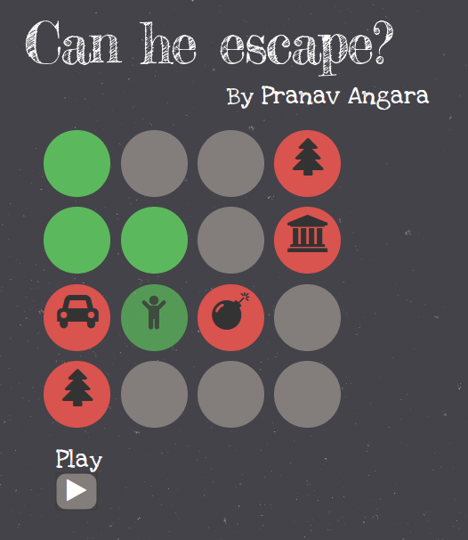

Can He Escape?
===============

This is a Ruby project that creates and attempts to solve a maze from a text file.
Not only does the ruby script print the results on the console, but it also renders it nicely on a web page.

The web page presents a nice simulation of the maze using JavaScript.

You can checkout a live demo of my project for a simple test case: (http://apranav19.github.io/CanHeEscape).

Here's a screenshot of my project:

